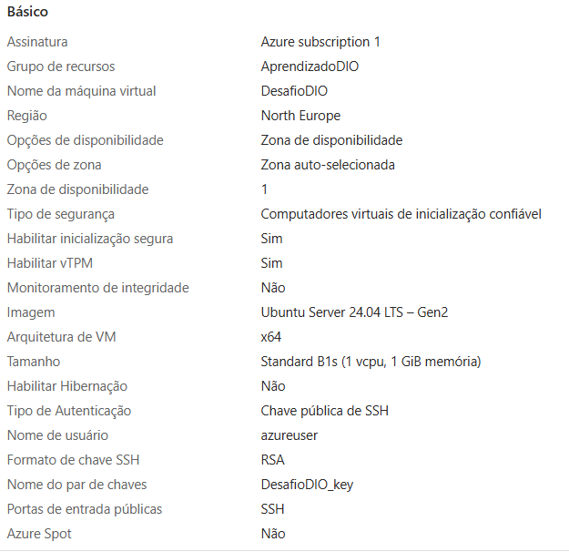
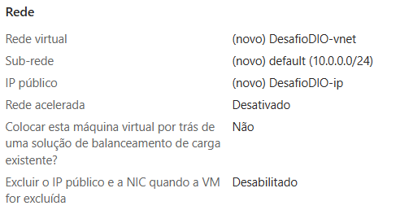
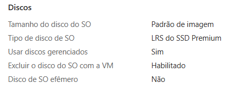
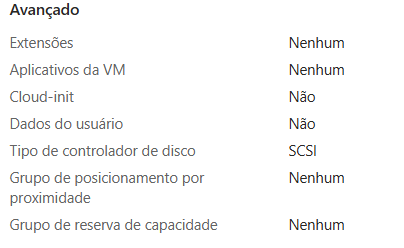
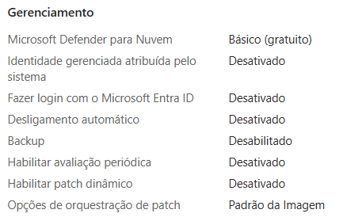
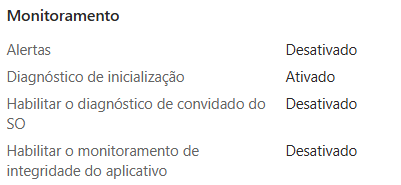
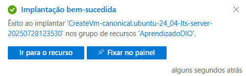
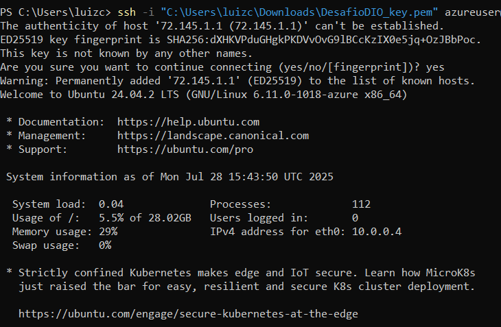

# Desafio DIO - Criação de Máquina Virtual no Azure

Este repositório documenta os passos realizados para a criação de uma máquina virtual (VM) na plataforma Microsoft Azure como parte do desafio da DIO.

##  Informações da VM

- **Nome da VM:** DesafioDIO  
- **Sistema Operacional:** Ubuntu Server 24.04 LTS (Gen2)  
- **Região:** North Europe  
- **Tamanho:** Standard B1s (1 vCPU, 1 GiB de memória)  
- **Autenticação:** Chave pública SSH  
- **Usuário da VM:** azureuser  
- **Grupo de recursos:** AprendizadoDIO  
- **Rede:** DesafioDIO-vnet com IP público DesafioDIO-ip  
- **Chave privada utilizada:** `DesafioDIO_key.pem`  

## 🔐 Acesso via SSH

Comando utilizado para conectar à VM:

```bash
ssh -i "Downloads/DesafioDIO_key.pem" azureuser@<72.145.1.1>
```

## ✅ Etapas Realizadas

1. Criação do grupo de recursos.
2. Configuração da rede virtual e IP público.
3. Geração e download da chave SSH.
4. Criação da VM com as configurações desejadas.
5. Conexão à máquina usando SSH a partir do terminal.

## 📸 Capturas de Tela

### Básico
  
### Rede
  
### Discos
  
### Avançado
  
### Gerenciamento
  
### Monitoramento
 
### Implantação Bem-Sucedida

### Conectando
  
